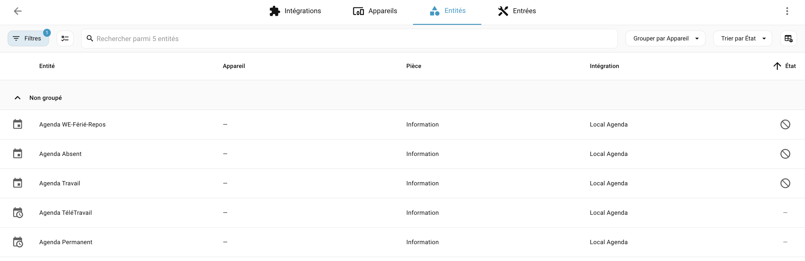
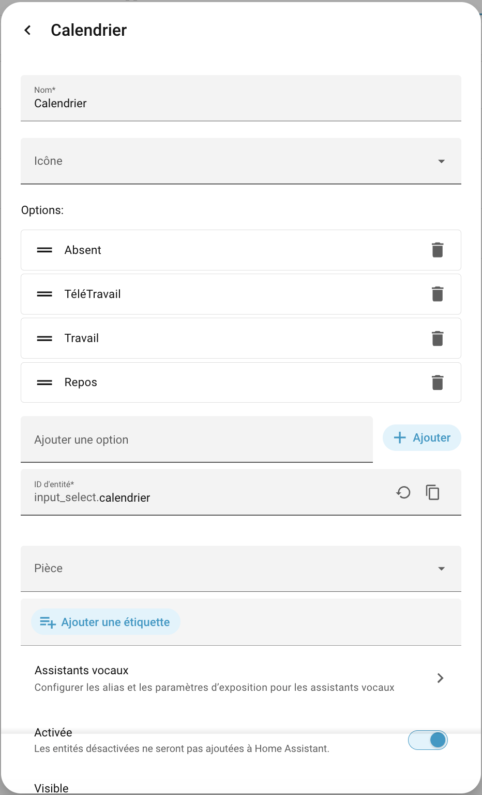
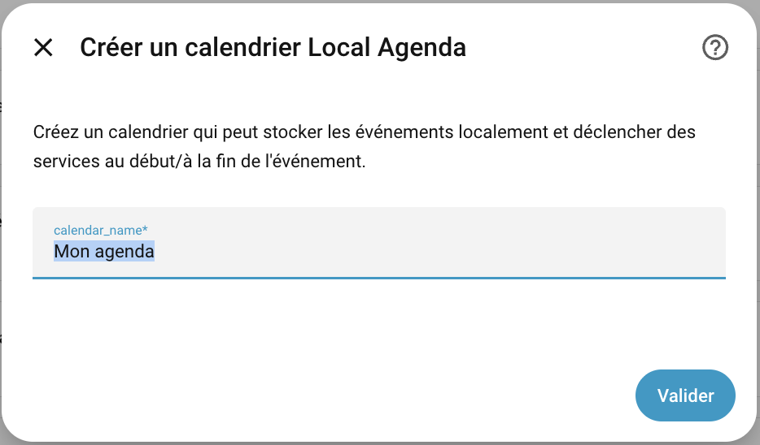
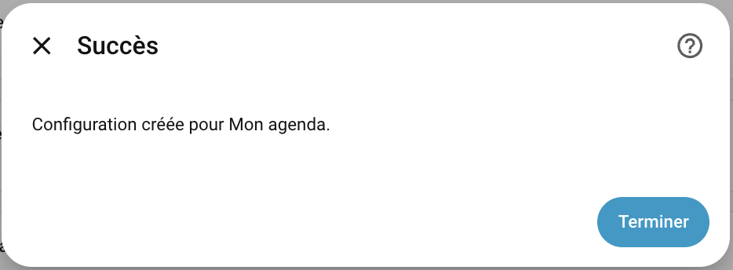
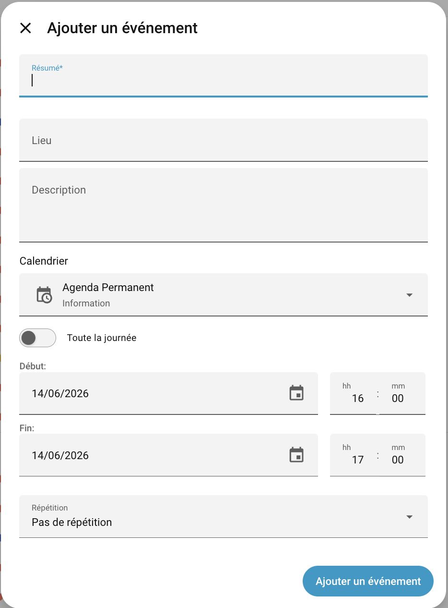
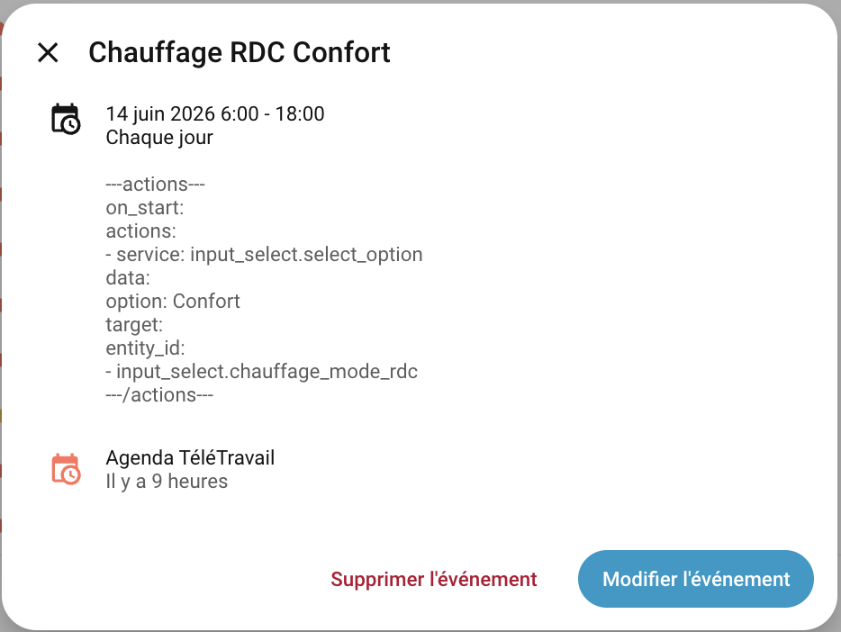
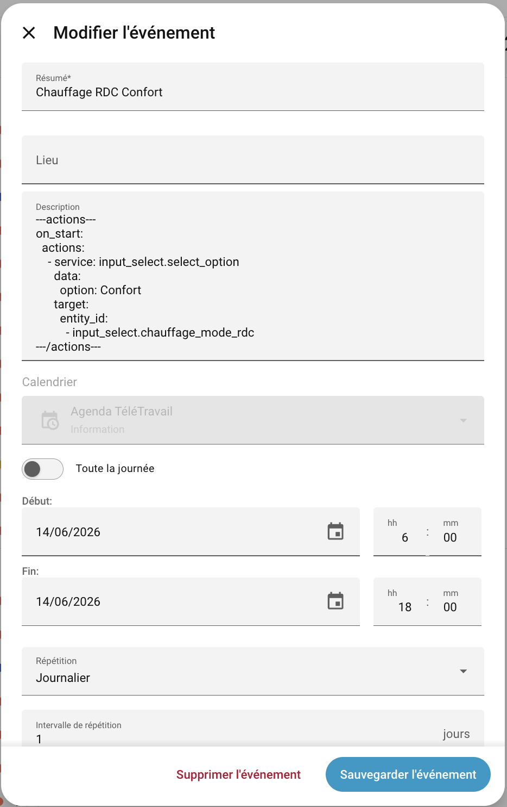
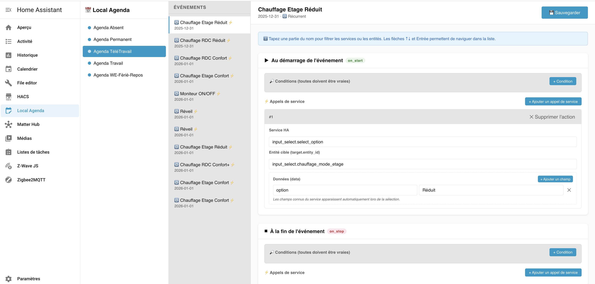

# Local Agenda

[![GitHub Release][releases-shield]][releases]
[](https://github.com/hacs/integration)
[](#)

Un composant personnalisé pour Home Assistant qui étend l'intégration `local_calendar` en ajoutant la possibilité de déclencher des services Home Assistant au début et/ou à la fin d'événements.

---

## Origine et conception

Cette intégration est née d'un **mixte entre deux approches** :

- **L'intégration `local_calendar` de Home Assistant** : elle fournit le socle de gestion des événements, le stockage ICS et l'interface calendrier native dans HA.
- **L'approche de Jeedom** : sur Jeedom, c'est l'événement lui-même qui porte et déclenche les actions. Ce principe a été transposé ici — chaque événement du calendrier embarque dans sa description le bloc YAML qui définit ce qu'il faut faire au démarrage et à l'arrêt.

### Problèmes rencontrés avec l'intégration native HA et solutions apportées

L'intégration calendrier native de Home Assistant utilise des **événements HA** (bus d'événements) pour déclencher les actions. Cette approche présente deux défauts critiques dans les cas réels :

1. **Événements croisés** : si l'événement A démarre, puis l'événement B démarre, puis A s'arrête, puis B s'arrête — les événements HA se mélangent et les déclenchements sont incorrects ou manqués.
2. **Événements proches** : lorsque la fin d'un événement et le début du suivant sont très rapprochés dans le temps, les transitions sont ratées ou doublées.

**Solution retenue** : Local Agenda n'utilise **pas** le bus d'événements HA. À la place, un **scheduleur interne interroge toutes les 20 secondes** (`async_track_time_interval`) la liste des événements dans une fenêtre glissante de ±22 secondes autour du moment présent. Chaque déclenchement est protégé par une **clé de déduplication unique** composée de l'`entry_id`, de l'`uid` de l'événement et de l'horodatage ISO de début ou de fin :

```
start_key = "{entry_id}:{uid}:{start_iso}:start"
stop_key  = "{entry_id}:{uid}:{end_iso}:stop"
```

Cette clé garantit qu'une même action n'est jamais déclenchée deux fois, même avec des événements croisés ou très proches. Les événements récurrents sont également correctement gérés : l'horodatage de l'occurrence est inclus dans la clé, de sorte que chaque occurrence d'un même événement récurrent obtient son propre ticket.

---

## Cas d'usage : gestion complète du chauffage

L'usage principal pour lequel cette intégration a été conçue est la **gestion du chauffage** pour deux zones indépendantes (Rez-de-chaussée et Étage), avec des horaires et des modes différents selon le type de journée.

### Organisation des agendas

Cinq agendas `Local Agenda` sont créés :

| Agenda | Rôle |
|---|---|
| **Agenda Travail** | Horaires de chauffage les jours où vous partez au bureau |
| **Agenda TéléTravail** | Horaires adaptés aux journées à domicile |
| **Agenda WE-Férié-Repos** | Horaires détendus pour les week-ends et jours fériés |
| **Agenda Absent** | Horaires hors-gel ou réduits lors des absences |
| **Agenda Permanent** | Règles actives en permanence, quel que soit le mode |

Un seul agenda de type journée est actif à la fois. Les entités des quatre agendas de type journée peuvent être **désactivées** dans le registre HA — les actions des agendas désactivés sont automatiquement ignorées par le scheduleur. L'Agenda Permanent est toujours actif.

La sélection du mode actif se fait généralement via un `input_select` (ex. `input_select.calendrier`) dont les valeurs correspondent aux types de journée. Les événements utilisent des **conditions** sur cet `input_select` pour n'agir que quand le bon contexte est actif.





### Exemple concret : événement de chauffage RDC (condition multi-états)

```
Chauffage RDC - Confort matin semaine

---actions---
on_start:
  conditions:
    - condition: or
      conditions:
        - condition: state
          entity_id: input_select.calendrier
          state: Travail
        - condition: state
          entity_id: input_select.calendrier
          state: TéléTravail
  actions:
    - service: input_select.select_option
      data:
        option: Confort
      target:
        entity_id: input_select.chauffage_mode_rdc
on_stop:
  actions:
    - service: input_select.select_option
      data:
        option: Réduit
      target:
        entity_id: input_select.chauffage_mode_rdc
---/actions---
```

---

## Installation

### HACS

[](https://my.home-assistant.io/redirect/hacs_repository/?owner=slemeur91&repository=local_agenda&category=integration)

### Manuellement

1. Copiez le dossier `local_agenda` dans `config/custom_components/` de votre installation Home Assistant.
2. Redémarrez Home Assistant.
3. **Paramètres → Appareils et services → Ajouter une intégration → Local Agenda**.

---

## Créer un agenda via l'interface HA

1. Allez dans **Paramètres → Appareils et services**.
2. Cliquez sur **+ Ajouter une intégration** et cherchez **Local Agenda**.
3. Saisissez le nom de l'agenda (ex. `Agenda Travail`). Ce nom apparaîtra dans la barre latérale du calendrier HA et dans le panneau Local Agenda.
4. Cliquez sur **Envoyer**. L'agenda est créé et son entité calendrier est disponible immédiatement.





---

## Créer et éditer des événements via le calendrier HA

### Accès au calendrier

Dans la barre latérale de HA, cliquez sur **Calendrier**. Vos agendas Local Agenda apparaissent dans la liste à gauche avec une case à cocher pour les afficher ou les masquer.

### Créer un événement

1. Cliquez sur un créneau horaire dans la vue calendrier (ou sur le bouton **+ Créer un événement**).
2. Renseignez le **titre** de l'événement.
3. Choisissez l'**agenda de destination** dans le sélecteur de calendrier.
4. Configurez les heures de début et de fin (des heures précises, pas "toute la journée").
5. Dans le champ **Description**, ajoutez votre texte libre puis le bloc `---actions---` (voir syntaxe ci-dessous).
6. Configurez la **récurrence** si besoin (quotidienne, hebdomadaire avec sélection des jours, etc.).
7. Cliquez sur **Créer**.



### Modifier un événement existant

Cliquez sur un événement dans le calendrier, puis sur le crayon ✏️. Le champ Description affiche le contenu complet, y compris le bloc YAML. Modifiez puis sauvegardez.





---

## Création et modification des actions

Les actions peuvent être définies de deux façons :

- **Directement dans la description de l'événement** via le calendrier HA, en saisissant manuellement le bloc YAML `---actions---` (méthode recommandée).
- **Via le panneau Local Agenda** accessible depuis le menu de HA, qui propose un éditeur intégré (fonctionnalité en cours d'épreuve).

### Syntaxe des actions

Les événements peuvent inclure un bloc spécial `---actions---` dans leur description pour définir les services à déclencher. Le bloc utilise la syntaxe YAML.

#### Format simple (sans conditions)

```
---actions---
on_start:
  actions:
    - service: domaine.nom_du_service
      data: {}
      target:
        entity_id:
          - switch.mon_interrupteur
on_stop:
  actions:
    - service: domaine.nom_du_service
      data: {}
      target:
        entity_id:
          - switch.mon_interrupteur
---/actions---
```

#### Format avec conditions

```
---actions---
on_start:
  conditions:
    - condition: state
      entity_id: input_select.nom_de_la_condition
      state: Etat
  actions:
    - service: domaine.nom_du_service
      data: {}
      target:
        entity_id:
          - switch.mon_interrupteur
on_stop:
  actions:
    - service: domaine.nom_du_service
      data: {}
      target:
        entity_id:
          - switch.mon_interrupteur
---/actions---
```

`on_start` et `on_stop` sont tous deux optionnels. Chaque appel de service prend en charge :

- `service` : **Obligatoire.** Format `domaine.nom_du_service` (ex. `switch.turn_on`).
- `target` : Optionnel. Dictionnaire avec `entity_id` ou d'autres informations de ciblage.
- `data` : Optionnel. Paramètres supplémentaires du service.
- `entity_id` : Optionnel. Raccourci pour `target: {entity_id: ...}`.

#### Types de conditions supportés

| Type | Description |
|---|---|
| `state` | Vérifie l'état d'une entité. `state` peut être une chaîne ou une liste de valeurs. |
| `or` | Au moins une des sous-conditions doit être vraie. |
| `and` | Toutes les sous-conditions doivent être vraies (comportement par défaut si plusieurs conditions sont listées au même niveau). |
| `not` | Aucune des sous-conditions ne doit être vraie. |

Les conditions de type inconnu sont **permissives** : elles ne bloquent pas l'exécution et génèrent un avertissement dans les logs.

#### Exemple 1 : Allumer un interrupteur au début, éteindre à la fin

```
Session d'arrosage de la pelouse

---actions---
on_start:
  actions:
    - service: switch.turn_on
      target:
        entity_id:
          - switch.arrosage_pelouse
on_stop:
  actions:
    - service: switch.turn_off
      target:
        entity_id:
          - switch.arrosage_pelouse
---/actions---
```

#### Exemple 2 : Démarrer les aspirateurs robots

```
Passage des aspirateurs

---actions---
on_start:
  actions:
    - service: vacuum.start
      target:
        entity_id:
          - vacuum.aspirateur_du_bas
          - vacuum.aspirateur_de_l_etage
---/actions---
```

#### Exemple 3 : Activer le mode hors-gel

```
Activation du Chauffage Hors Gel

---actions---
on_start:
  actions:
    - service: input_boolean.turn_on
      target:
        entity_id:
          - input_boolean.chauffage_horsgel
---/actions---
```

#### Exemple 4 : Chauffage conditionnel selon le mode de journée

```
Positionnement du Chauffage du Rez De Chaussée en Réduit
Appliqué uniquement lorsque le calendrier est sur Absent

---actions---
on_start:
  conditions:
    - condition: state
      entity_id: input_select.calendrier
      state: Absent
  actions:
    - service: input_select.select_option
      data:
        option: Réduit
      target:
        entity_id:
          - input_select.chauffage_mode_rdc
---/actions---
```

#### Exemple 5 : 2 conditions et 2 actions (Travail OU TéléTravail, RDC et Étage)

```
Chauffage RDC et Étage Confort - Matin semaine

---actions---
on_start:
  conditions:
    - condition: or
      conditions:
        - condition: state
          entity_id: input_select.calendrier
          state: Travail
        - condition: state
          entity_id: input_select.calendrier
          state: TéléTravail
  actions:
    - service: input_select.select_option
      data:
        option: Confort
      target:
        entity_id:
          - input_select.chauffage_mode_rdc
    - service: input_select.select_option
      data:
        option: Confort
      target:
        entity_id:
          - input_select.chauffage_mode_etage
on_stop:
  actions:
    - service: input_select.select_option
      data:
        option: Réduit
      target:
        entity_id:
          - input_select.chauffage_mode_rdc
    - service: input_select.select_option
      data:
        option: Réduit
      target:
        entity_id:
          - input_select.chauffage_mode_etage
---/actions---
```

### Panneau Local Agenda du menu HA

> ⚠️ **Note** : Ce panneau a été développé en dernier et n'a pas encore été complètement éprouvé. Il peut présenter des comportements inattendus. La méthode recommandée et fiable pour éditer les actions reste la saisie directe du bloc YAML dans le champ Description de l'événement via le calendrier HA.

Une fois l'intégration installée, une entrée **Local Agenda** apparaît automatiquement dans la barre latérale de HA (icône calendrier avec crayon). Ce panneau offre une vue centralisée pour consulter et modifier les actions de tous vos agendas sans passer par l'éditeur d'événements du calendrier HA.

Un menu déroulant liste tous les agendas existants. La sélection d'un agenda affiche ses événements triés par date de début, avec un indicateur visuel signalant la présence d'un bloc d'actions. Cliquez sur un événement pour ouvrir l'éditeur YAML du bloc `---actions---` directement dans l'interface. La sauvegarde met à jour la description de l'événement dans le fichier ICS et rafraîchit immédiatement l'entité calendrier dans HA.



---

## Fonctionnement interne

### Scheduleur

Le composant enregistre un timer via `async_track_time_interval` qui se déclenche toutes les **20 secondes**. À chaque tick, il parcourt tous les événements de tous les agendas actifs dans une fenêtre glissante de **±22 secondes** autour du moment présent :

- Si l'heure de **début** d'un événement tombe dans la fenêtre → les actions `on_start` sont exécutées.
- Si l'heure de **fin** d'un événement tombe dans la fenêtre → les actions `on_stop` sont exécutées.

### Stockage

Les événements sont stockés dans `.storage/local_agenda_{nom_de_lagenda}.ics`, indépendamment du stockage de l'intégration native `local_calendar`, pour éviter tout conflit.

### API WebSocket (utilisée par le panneau)

Le panneau Local Agenda communique avec HA via des commandes WebSocket dédiées :

| Commande | Rôle |
|---|---|
| `local_agenda/list_calendars` | Liste tous les agendas créés |
| `local_agenda/get_events` | Retourne les événements d'un agenda (uniquement les événements maîtres, hors overrides récurrents) |
| `local_agenda/get_actions` | Lit le bloc d'actions d'un événement spécifique |
| `local_agenda/set_actions` | Écrit/met à jour le bloc d'actions dans la description et sauvegarde le fichier ICS |
| `local_agenda/get_ha_services` | Retourne tous les services HA disponibles (pour l'éditeur) |
| `local_agenda/get_ha_entities` | Retourne toutes les entités HA avec leur état courant (pour l'éditeur) |

---

## Limitations

- La granularité d'interrogation est de 20 secondes ; les actions se déclenchent avec une précision d'environ ±20 secondes.
- La déduplication est **en mémoire** : si Home Assistant redémarre en cours d'événement, les actions peuvent être rejouées si la fenêtre de ±22 s est de nouveau satisfaite au redémarrage.
- Si Home Assistant est hors ligne lors d'une transition d'événement, le déclenchement rétroactif n'a pas lieu.
- Les heures des événements doivent être des **heures précises** (pas des événements "toute la journée") pour que les déclenchements fonctionnent correctement.
- Les événements récurrents fonctionnent ; les remplacements spécifiques à une occurrence (exception RECURRENCE-ID) sont ignorés dans le panneau (seuls les événements maîtres sont affichés).

---

## Logs et diagnostic

Les actions déclenchées sont journalisées au niveau **INFO** :

```
local_agenda: [start] 'Chauffage RDC Confort - Matin' → input_select.select_option
```

Les erreurs d'appel de service sont journalisées au niveau **ERROR** mais n'interrompent pas la boucle — les autres actions de l'événement continuent de s'exécuter.

Les conditions non satisfaites sont journalisées au niveau **DEBUG** :

```
local_agenda: condition not met for 'Chauffage RDC Confort - Matin' [start] — skipping
```

Pour activer les logs de débogage, ajoutez dans `configuration.yaml` :

```yaml
logger:
  logs:
    custom_components.local_agenda: debug
```


---

[releases-shield]: https://img.shields.io/github/release/slemeur91/local_agenda.svg?style=flat-square
[releases]: https://github.com/slemeur91/local_agenda/releases
